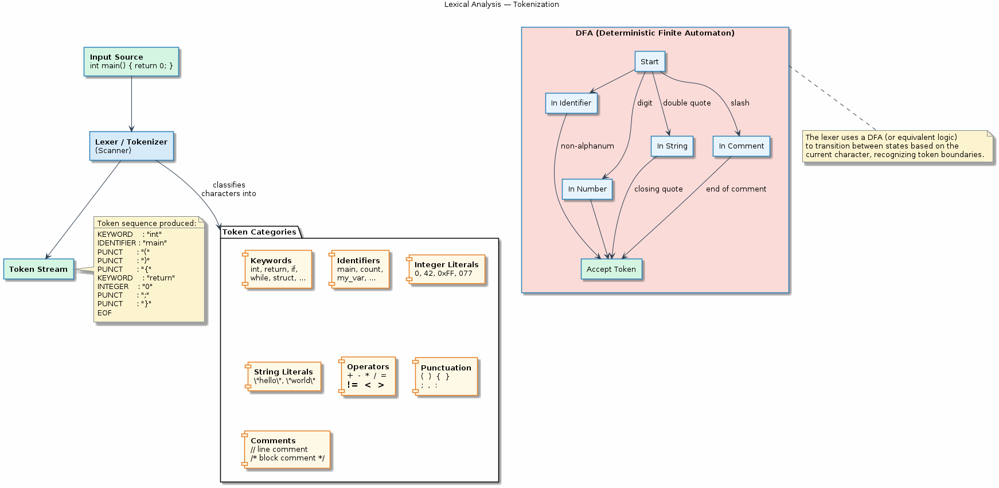
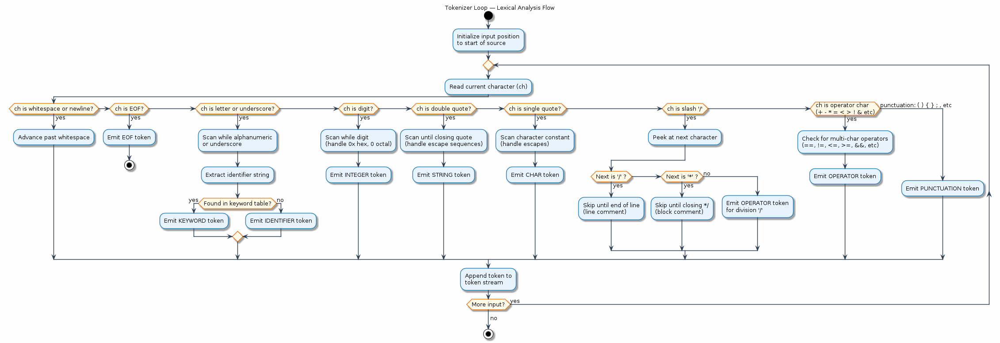

# Chapter 18 — Lexical Analysis (Tokenisation)

## Overview
Lexical analysis is the first phase of a compiler's front-end. It reads a stream
of characters and groups them into meaningful chunks called *tokens*—keywords,
identifiers, numeric literals, operators, and punctuation. This chapter builds a
hand-written tokenizer for a subset of C, demonstrating core concepts like
deterministic finite automata (DFAs), the maximal-munch rule, and the
keyword-vs-identifier distinction.

## Key Concepts
- Tokens as the atomic units of a programming language
- Token categories: keywords, identifiers, literals, operators, punctuation
- Deterministic Finite Automata (DFA) and state-machine-driven scanning
- The maximal munch (longest match) rule
- Hand-written tokenizer design and implementation
- Distinguishing keywords from identifiers via lookup tables
- Handling whitespace, comments, and string literals
- Error recovery in the lexer

## Sections
| # | Section | Description |
|---|---------|-------------|
| 1 | What Is Lexical Analysis | Role of the lexer in the compilation pipeline |
| 2 | Token Categories | Keywords, identifiers, integer/float literals, operators, punctuation |
| 3 | The Scanning Process | Character-by-character reading and token emission |
| 4 | DFA and State Machines | Modelling the lexer as a finite automaton |
| 5 | Maximal Munch Rule | Why `>=` is one token, not `>` followed by `=` |
| 6 | Hand-Written Tokenizer | Walking through the demo implementation |
| 7 | Keywords vs Identifiers | Post-scan keyword lookup to reclassify identifiers |

## Building & Running
```bash
make bin/18_lexical_analysis
./bin/18_lexical_analysis
```

## Diagrams
- 
- 

## Try It Yourself
```bash
# Run the demo to tokenize sample C code
./bin/18_lexical_analysis

# Pipe your own C snippet into the tokenizer (if stdin mode is supported)
echo 'int x = 42 + y;' | ./bin/18_lexical_analysis

# Compare with GCC's internal tokenization (preprocessed output shows token boundaries)
gcc -E -dD src/18_lexical_analysis/lexical_analysis.c | head -30

# Experiment: add a new operator to the tokenizer and rebuild
# Edit src/18_lexical_analysis/lexical_analysis.c, then:
make bin/18_lexical_analysis && ./bin/18_lexical_analysis
```

## Further Reading
- *Compilers: Principles, Techniques, and Tools* (Aho, Lam, Sethi, Ullman) — Chapter 3: Lexical Analysis
- *Crafting Interpreters* (Robert Nystrom) — [Chapter 4: Scanning](https://craftinginterpreters.com/scanning.html)
- *Engineering a Compiler* (Cooper & Torczon) — Chapter 2: Scanners
