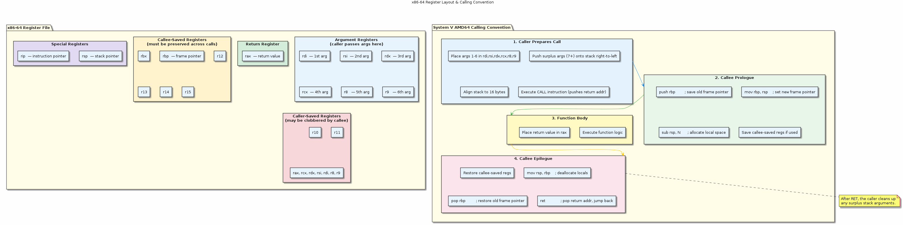
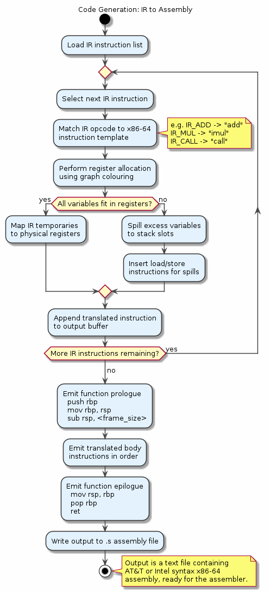

# Chapter 23 — Code Generation

## Overview

Code generation is the compiler's final major phase — translating an optimised intermediate representation into actual machine instructions for the target architecture. This chapter focuses on the x86-64 target and the System V ABI, covering how the compiler selects instructions, allocates registers using graph colouring, constructs function prologues and epilogues, and integrates with the platform calling convention to produce correct, efficient assembly.

## Key Concepts

- Mapping IR operations to concrete machine instructions
- x86-64 general-purpose registers and their conventional roles
- System V AMD64 ABI calling convention (argument passing, return values)
- Function prologue and epilogue: stack frame setup and teardown
- Instruction selection strategies (macro expansion, tree-pattern matching)
- Register allocation via graph colouring of the interference graph
- Spilling: when registers run out and values go to the stack
- Reading and understanding compiler-generated assembly

## Sections

| # | Section | Description |
|---|---------|-------------|
| 1 | From IR to Machine Code | Overview of the code generation pipeline |
| 2 | x86-64 Registers | RAX–R15, XMM0–XMM15, caller- vs callee-saved under System V |
| 3 | Function Prologue and Epilogue | `push rbp`, stack alignment, local variable allocation, teardown |
| 4 | Instruction Selection | Translating IR nodes into x86-64 instructions |
| 5 | Register Allocation | Liveness analysis and assigning variables to physical registers |
| 6 | Graph Colouring | Building the interference graph and colouring with k registers |
| 7 | Spilling | Handling the case when colouring fails — spill slots and reload code |
| 8 | Assembly Walkthrough | Step-by-step reading of GCC-generated assembly for a sample function |

## Building & Running

```bash
make bin/23_code_generation
./bin/23_code_generation
```

## Diagrams

- 
- 

## Try It Yourself

```bash
# Generate Intel-syntax assembly from a C source file
gcc -S -masm=intel -o sample.s sample.c
cat sample.s

# Disassemble a compiled object file
gcc -c sample.c -o sample.o
objdump -d -M intel sample.o

# Compare unoptimised vs optimised code generation
gcc -S -O0 -masm=intel -o sample_O0.s sample.c
gcc -S -O2 -masm=intel -o sample_O2.s sample.c
diff sample_O0.s sample_O2.s

# See register allocation decisions (GCC dump)
gcc -O2 -fdump-rtl-ira -c sample.c
```

## Further Reading

- Cooper & Torczon, *Engineering a Compiler*, 2nd ed. — Chapters 11–13: Instruction Selection, Register Allocation, Instruction Scheduling
- [System V AMD64 ABI Reference](https://refspecs.linuxfoundation.org/elf/x86_64-abi-0.99.pdf)
- [x86-64 Instruction Set Reference (Félix Cloutier)](https://www.felixcloutier.com/x86/)
