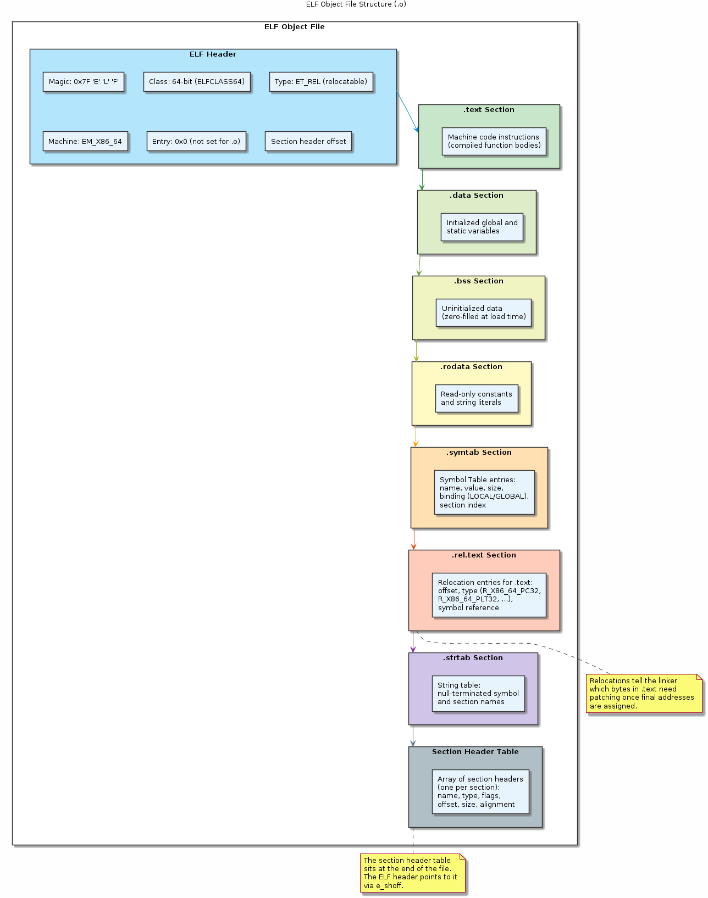
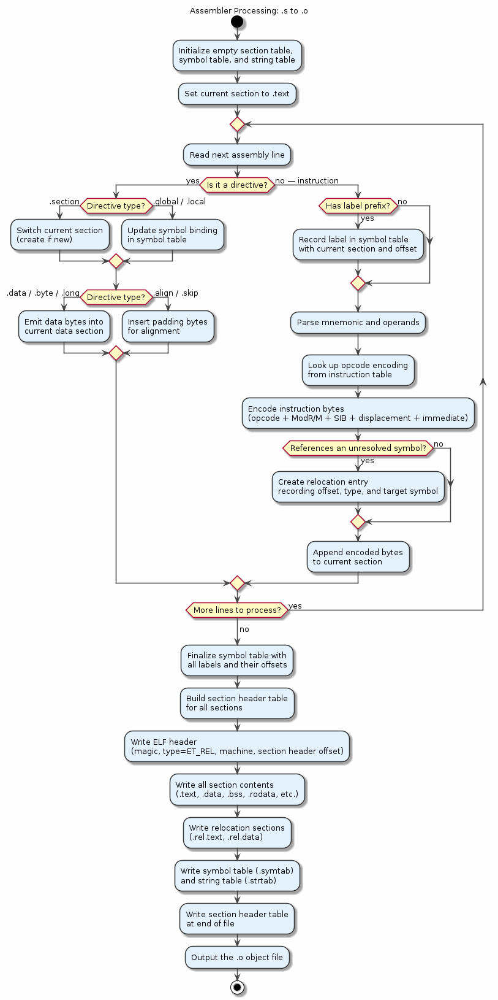

# Chapter 24 — The Assembler and ELF Object Files

## Overview

The assembler is the bridge between human-readable assembly text and the binary object files the linker consumes. On Linux, those object files use the **ELF (Executable and Linkable Format)** — a structured container that organises machine code, data, symbols, and relocation entries into well-defined sections. This chapter explains what the assembler does, dissects the ELF layout, and shows how to inspect every part of an object file with standard command-line tools.

## Key Concepts

- The assembler's role: translating mnemonic text into binary machine code
- ELF format: header, section header table, program header table
- Key sections: `.text`, `.data`, `.bss`, `.rodata`, `.symtab`, `.strtab`, `.rel.text`
- Symbol table entries: name, value, size, binding (LOCAL / GLOBAL / WEAK), type
- Relocations: placeholder addresses the linker must patch (R_X86_64_PC32, R_X86_64_PLT32)
- Section flags: SHF_ALLOC, SHF_WRITE, SHF_EXECINSTR
- Difference between relocatable objects (`.o`) and final executables / shared libraries

## Sections

| # | Section | Description |
|---|---------|-------------|
| 1 | What the Assembler Does | Encoding mnemonics, resolving local labels, emitting relocations |
| 2 | ELF Format Overview | ELF header, section header table, segment/program header table |
| 3 | Key Sections | `.text`, `.data`, `.bss`, `.rodata`, `.symtab`, `.strtab`, `.rel`/`.rela` |
| 4 | Symbol Table | Structure of an ELF symbol entry and what each field means |
| 5 | Symbol Types | LOCAL, GLOBAL, WEAK bindings; FUNC, OBJECT, NOTYPE types |
| 6 | Relocations | How the assembler marks addresses for the linker to fix up |
| 7 | Section Flags | Permissions and allocation hints: ALLOC, WRITE, EXECINSTR |
| 8 | Inspecting Object Files | Hands-on tour with `readelf`, `nm`, `objdump`, and `hexdump` |

## Building & Running

```bash
make bin/24_assembler_elf
./bin/24_assembler_elf
```

## Diagrams

- 
- 

## Try It Yourself

```bash
# Assemble a source file into an ELF object
gcc -S sample.c -o sample.s
as sample.s -o sample.o

# Inspect the ELF header
readelf -h sample.o

# List all sections and their flags
readelf -S sample.o

# Dump the symbol table
readelf -s sample.o
nm sample.o

# Show relocation entries
readelf -r sample.o

# Disassemble the .text section
objdump -d sample.o

# Hex-dump a specific section
readelf -x .rodata sample.o
```

## Further Reading

- [ELF Specification (Tool Interface Standard)](https://refspecs.linuxfoundation.org/elf/elf.pdf)
- Ian Lance Taylor, [Linkers — 20-part blog series](https://www.airs.com/blog/archives/38)
- `man 5 elf` — the Linux ELF manual page
