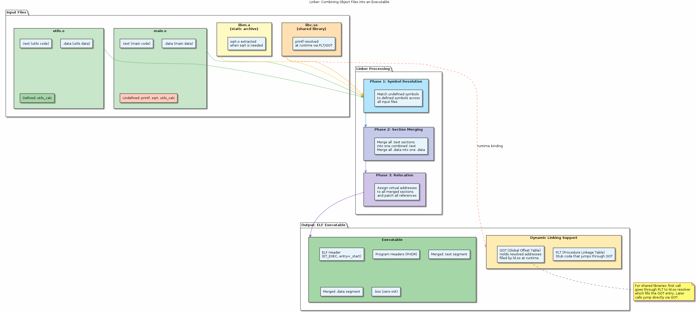
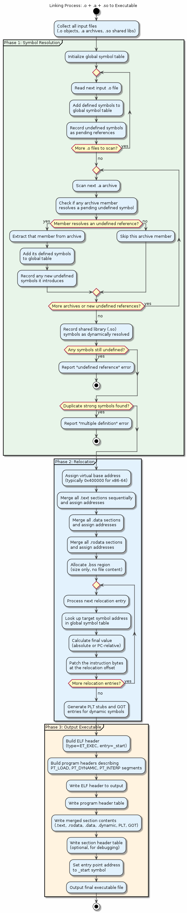

# Chapter 25 — The Linker

## Overview

The linker is the final stage of the build pipeline — it takes one or more relocatable object files (and libraries), resolves every symbolic reference, applies relocations, merges sections, and produces a single executable or shared library. This chapter covers both **static linking** (archives, `.a`) and **dynamic linking** (shared objects, `.so`, PLT/GOT, lazy binding), explains symbol resolution rules including strong and weak symbols, introduces linker scripts, and catalogues the most common linker errors and how to fix them.

## Key Concepts

- Symbol resolution: matching references to definitions across object files
- Strong vs weak symbols and the rules that govern conflicts
- Relocation: patching placeholder addresses with final values
- Section merging: combining `.text` from many `.o` files into one output `.text`
- Static linking with archive libraries (`.a`)
- Dynamic linking with shared objects (`.so`), the PLT, and the GOT
- Lazy binding and `LD_BIND_NOW`
- Linker scripts for custom memory layouts
- Common errors: undefined reference, multiple definition, missing `-l` flags

## Sections

| # | Section | Description |
|---|---------|-------------|
| 1 | What the Linker Does | High-level view: resolve, relocate, merge, emit |
| 2 | Symbol Resolution | Scanning object files and libraries to match every reference |
| 3 | Strong and Weak Symbols | Rules for conflicts; `__attribute__((weak))` and defaults |
| 4 | Relocation | Patching code and data with final addresses after layout |
| 5 | Section Merging | How input sections from many objects become output sections |
| 6 | Static Linking | Creating and using archive libraries (`ar`, `ranlib`, `-static`) |
| 7 | Dynamic Linking | Shared objects, `LD_LIBRARY_PATH`, `rpath`, `soname` conventions |
| 8 | PLT and GOT | Procedure Linkage Table and Global Offset Table for lazy resolution |
| 9 | Linker Scripts | Controlling section placement, entry point, and memory regions |
| 10 | Common Errors | Diagnosing undefined references, multiple definitions, and link order issues |

## Building & Running

```bash
make bin/25_linker
./bin/25_linker
```

## Diagrams

- 
- 

## Try It Yourself

```bash
# See the full linker invocation GCC uses behind the scenes
gcc -v sample.c -o sample 2>&1 | grep collect2

# Print the default linker script
ld --verbose

# Inspect symbols in an object file
nm sample.o

# List shared library dependencies of an executable
ldd ./sample

# Trace dynamic symbol resolution at runtime
LD_DEBUG=bindings ./sample

# Create and use a static library
gcc -c util.c -o util.o
ar rcs libutil.a util.o
gcc main.c -L. -lutil -o main_static

# Create and use a shared library
gcc -shared -fPIC util.c -o libutil.so
gcc main.c -L. -lutil -o main_dynamic
LD_LIBRARY_PATH=. ./main_dynamic
```

## Further Reading

- Ian Lance Taylor, [Linkers — 20-part blog series](https://www.airs.com/blog/archives/38)
- John Levine, *Linkers and Loaders* (Morgan Kaufmann)
- `man ld` — GNU linker documentation and linker script syntax
