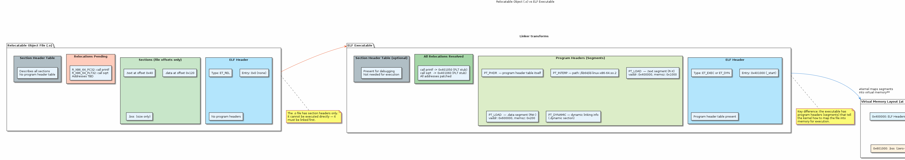
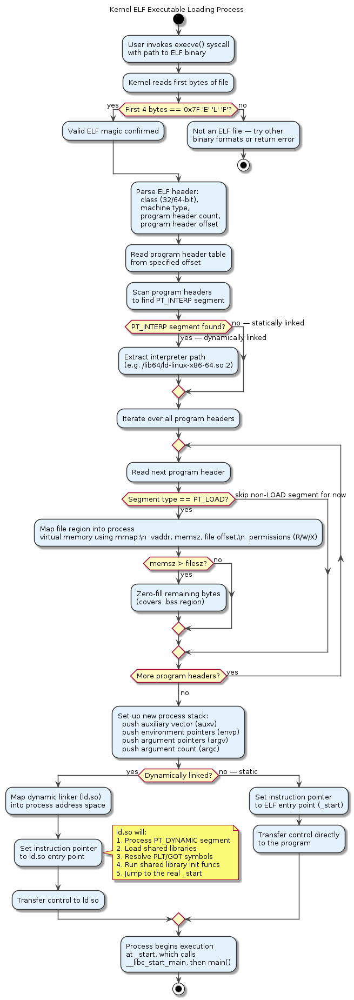

# Chapter 26 — ELF Executable Format

## Overview
Every compiled C program on Linux becomes an ELF (Executable and Linkable Format) binary. This chapter dissects the structure of ELF executables — from the magic bytes at offset zero through the program headers that tell the kernel how to map the binary into memory. Understanding ELF is essential for debugging linker errors, writing custom loaders, and reasoning about security features like PIE and ASLR.

## Key Concepts
- Difference between relocatable objects (`.o`) and fully-linked executables
- ELF header fields: `e_ident` magic, `e_type` (ET_EXEC vs ET_DYN), `e_entry`
- Program header types: PHDR, INTERP, LOAD, DYNAMIC, NOTE, GNU_STACK
- Section headers vs program headers (link-time vs run-time views)
- Virtual address layout and segment alignment
- The `.interp` section and how the kernel finds the dynamic linker
- Position-Independent Executables (PIE) and Address Space Layout Randomisation (ASLR)
- How `e_entry` differs between static and dynamically-linked binaries

## Sections
| # | Section | Description |
|---|---------|-------------|
| 1 | ELF Magic & Identification | The 16-byte `e_ident` array — magic number, class, endianness, OS/ABI |
| 2 | ELF Header Fields | `e_type`, `e_machine`, `e_entry`, `e_phoff`, `e_shoff` and what they mean |
| 3 | Relocatable vs Executable | How the linker transforms `.o` files into a runnable binary |
| 4 | Program Headers | PHDR, INTERP, LOAD segments — the kernel's recipe for memory mapping |
| 5 | DYNAMIC Segment | The dynamic section and its role in runtime linking |
| 6 | Virtual Address Layout | How LOAD segments define the process image in memory |
| 7 | PIE and ASLR | Position-independent executables and randomised base addresses |

## Building & Running
```bash
make bin/26_elf_executable
./bin/26_elf_executable
```

## Diagrams
- 
- 

## Try It Yourself
```bash
# Inspect the ELF header
readelf -h bin/26_elf_executable

# List program headers (segments)
readelf -l bin/26_elf_executable

# List section headers
readelf -S bin/26_elf_executable

# Identify file type (ET_EXEC vs ET_DYN for PIE)
file bin/26_elf_executable

# Dump the first 16 bytes to see the ELF magic
hexdump -C -n 16 bin/26_elf_executable

# Compare a .o file with the final executable
readelf -h src/26_elf_executable/main.o
```

## Further Reading
- [ELF Specification (Tool Interface Standard)](https://refspecs.linuxfoundation.org/elf/elf.pdf)
- [man 5 elf](https://man7.org/linux/man-pages/man5/elf.5.html) — Linux ELF manual page
- Ian Lance Taylor, [Linkers — 20 part blog series](https://lwn.net/Articles/276782/)
