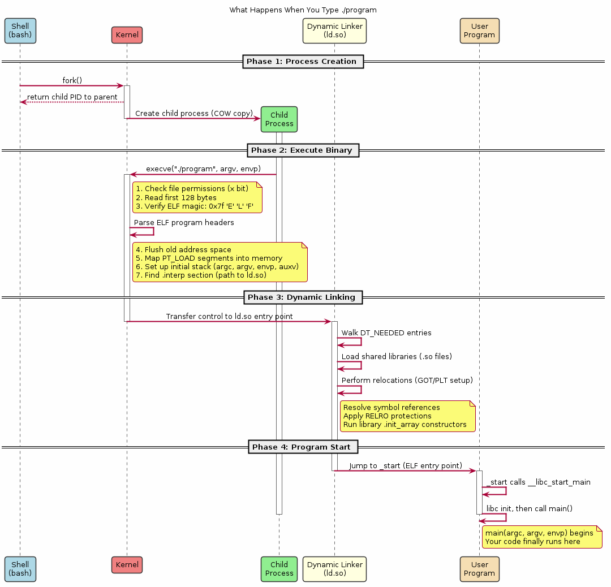
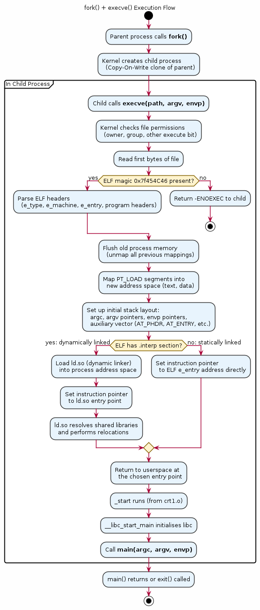

# Chapter 27 — Kernel Program Execution

## Overview
When you type `./program` and press Enter, a precise chain of events unfolds — the shell calls `fork()`, the child calls `execve()`, and the kernel takes over to load the ELF binary, set up the initial stack, and transfer control. This chapter traces the complete execution path from shell command to the first instruction of your program, including how the kernel handles shebang scripts and constructs the initial process stack.

## Key Concepts
- The `fork()` + `exec()` pattern and why both are needed
- `execve()` kernel-side: binary format detection and `load_elf_binary()`
- Initial stack layout: `argc`, `argv[]`, `envp[]`, auxiliary vector (`auxv`)
- Auxiliary vector entries: `AT_PHDR`, `AT_ENTRY`, `AT_RANDOM`, `AT_EXECFN`
- Shebang (`#!`) handling — how the kernel re-invokes with the interpreter
- The role of `vfork()` and `posix_spawn()` as optimised alternatives
- How the kernel maps the ELF LOAD segments before jumping to `e_entry`
- File descriptor inheritance across `exec()`

## Sections
| # | Section | Description |
|---|---------|-------------|
| 1 | Shell to Kernel | What the shell does before your program starts: fork, close, dup, exec |
| 2 | `execve()` System Call | Kernel entry: permission checks, binary format search |
| 3 | Loading the ELF | `load_elf_binary()` — mapping segments and setting `brk` |
| 4 | Initial Stack Layout | How the kernel fills the stack with argc, argv, envp, auxv |
| 5 | Shebang Scripts | Kernel handling of `#!/usr/bin/env python3` and recursive exec |
| 6 | Live Fork Demo | A working `fork()` + `execve()` example with wait status |
| 7 | Tracing Execution | Using `strace` to observe the complete exec path |

## Building & Running
```bash
make bin/27_kernel_exec
./bin/27_kernel_exec
```

## Diagrams
- 
- 

## Try It Yourself
```bash
# Trace system calls for the program
strace ./bin/27_kernel_exec

# Trace fork'd children too
strace -f ./bin/27_kernel_exec

# Examine the auxiliary vector
LD_SHOW_AUXV=1 ./bin/27_kernel_exec

# Read auxv from a running process
cat /proc/self/auxv | hexdump -C

# Observe the initial stack from /proc
cat /proc/self/maps | grep stack

# Check what strace shows for a shebang script
echo -e '#!/bin/sh\necho hello' > /tmp/shebang_test.sh && chmod +x /tmp/shebang_test.sh
strace /tmp/shebang_test.sh 2>&1 | head -5
```

## Further Reading
- [man 2 execve](https://man7.org/linux/man-pages/man2/execve.2.html) — execve system call
- Linux kernel source: `fs/binfmt_elf.c` — ELF binary loader
- LWN.net, [How programs get run](https://lwn.net/Articles/630727/)
