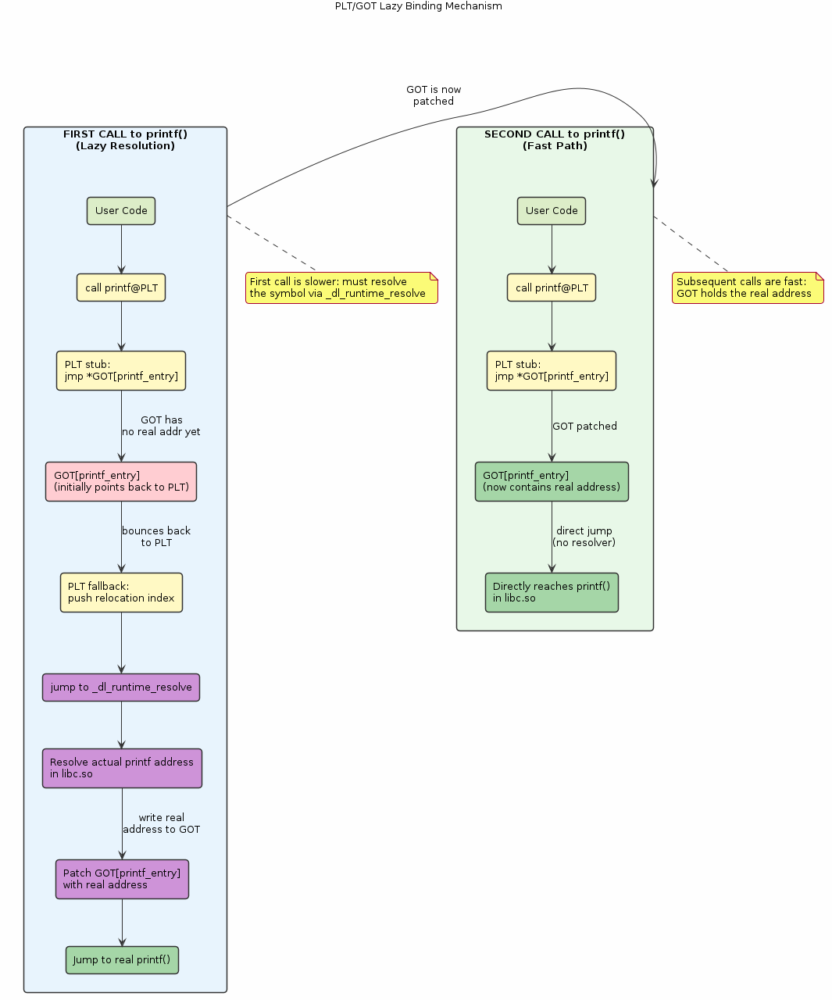
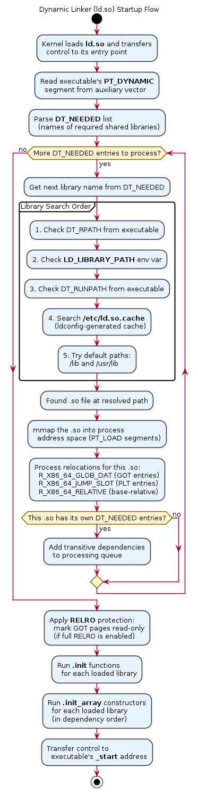

# Chapter 28 — The Dynamic Linker (ld.so)

## Overview
Before `main()` runs, the dynamic linker (`ld-linux-x86-64.so.2`) quietly resolves every shared library your program depends on. This chapter explores the full dynamic linking pipeline — from library search paths through PLT/GOT lazy binding to runtime loading with `dlopen()`. Understanding the dynamic linker is critical for diagnosing "symbol not found" errors, optimising startup time, and building plugin architectures.

## Key Concepts
- `ld-linux-x86-64.so.2` — the ELF interpreter specified in `.interp`
- Library search order: `DT_RPATH`, `LD_LIBRARY_PATH`, `DT_RUNPATH`, ldconfig cache, `/lib`, `/usr/lib`
- PLT (Procedure Linkage Table) and GOT (Global Offset Table) lazy binding mechanism
- Position-Independent Code (PIC) and the Global Offset Table
- `dlopen()` / `dlsym()` / `dlclose()` for runtime dynamic loading
- `__attribute__((constructor))` and `__attribute__((destructor))` functions
- `LD_DEBUG` environment variable for diagnosing linker behaviour
- Symbol versioning and `LD_PRELOAD` interposition

## Sections
| # | Section | Description |
|---|---------|-------------|
| 1 | The ELF Interpreter | How the kernel hands control to `ld.so` via the `.interp` section |
| 2 | Library Search Order | RPATH, LD_LIBRARY_PATH, RUNPATH, ldconfig cache — the full search chain |
| 3 | PLT/GOT Lazy Binding | How the first call to a library function triggers symbol resolution |
| 4 | Position-Independent Code | Why `-fPIC` matters and how the GOT enables shared libraries |
| 5 | Runtime Loading: dlopen | Live demo: loading a shared library and resolving symbols at runtime |
| 6 | Constructors & Destructors | `__attribute__((constructor/destructor))` and shared library init/fini |
| 7 | Debugging with LD_DEBUG | Using `LD_DEBUG=all` to trace every linker decision |

## Building & Running
```bash
make bin/28_dynamic_linker
./bin/28_dynamic_linker
```

## Diagrams
- 
- 

## Try It Yourself
```bash
# Trace all dynamic linker activity
LD_DEBUG=all ./bin/28_dynamic_linker 2>&1 | head -80

# List shared library dependencies
ldd ./bin/28_dynamic_linker

# Show the DYNAMIC segment (NEEDED, RPATH, RUNPATH)
readelf -d ./bin/28_dynamic_linker

# Disassemble the PLT to see lazy binding stubs
objdump -d -j .plt ./bin/28_dynamic_linker

# Examine GOT entries
objdump -d -j .got.plt ./bin/28_dynamic_linker

# Check which symbols are resolved at runtime
LD_DEBUG=bindings ./bin/28_dynamic_linker 2>&1 | grep "binding"

# Preload a library
LD_PRELOAD=./libmy_override.so ./bin/28_dynamic_linker
```

## Further Reading
- [man 8 ld.so](https://man7.org/linux/man-pages/man8/ld.so.8.html) — dynamic linker/loader manual
- [man 3 dlopen](https://man7.org/linux/man-pages/man3/dlopen.3.html) — runtime dynamic loading
- Ulrich Drepper, [How To Write Shared Libraries](https://www.akkadia.org/drepper/dsohowto.pdf)
