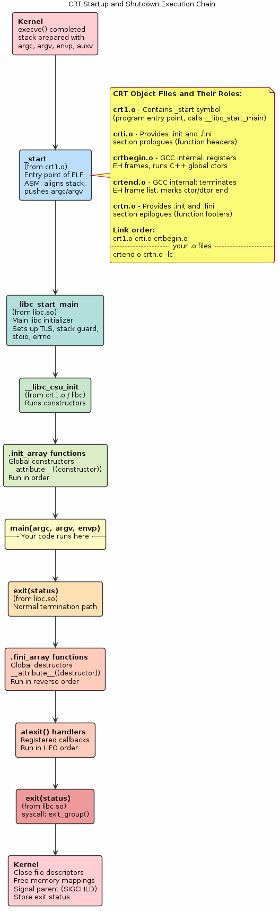
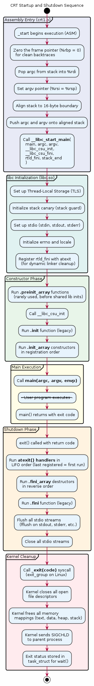

# Chapter 30 — CRT Startup and Runtime Initialisation

## Overview
Your `main()` function is never the first thing that runs. Before it executes, the C Runtime (CRT) startup code performs critical initialisation — setting up the stack, calling global constructors, registering `atexit` handlers, and eventually calling `main()` with the correct arguments. This chapter traces the path from `_start` through `__libc_start_main` to `main()`, examines the CRT object files the linker pulls in, and demonstrates how to write a freestanding `_start` entry point.

## Key Concepts
- `_start` — the true entry point, written in assembly
- `__libc_start_main()` — glibc's master initialisation routine
- CRT object files: `crt1.o` (contains `_start`), `crti.o`, `crtn.o`, `crtbegin.o`, `crtend.o`
- `.init_array` / `.fini_array` sections and constructor ordering
- `atexit()` and `__cxa_atexit()` handler registration and LIFO execution
- The difference between `exit()` (runs handlers) and `_exit()` (does not)
- Writing a freestanding `_start` without libc
- How `__libc_start_main` sets up `stdin`/`stdout`/`stderr`

## Sections
| # | Section | Description |
|---|---------|-------------|
| 1 | The Real Entry: _start | Assembly-level `_start` — extracting argc/argv from the stack |
| 2 | __libc_start_main | What glibc does before calling `main()`: init, fini, stack guard |
| 3 | CRT Object Files | `crt1.o`, `crti.o`, `crtn.o` — what each file contributes |
| 4 | .init_array & .fini_array | How `__attribute__((constructor))` functions get registered and called |
| 5 | atexit Handlers | Live demo: registering multiple `atexit()` callbacks and observing LIFO order |
| 6 | Freestanding _start | Writing a minimal `_start` with inline assembly and `syscall` |
| 7 | Observing CRT Linkage | Using `gcc -v` and `readelf` to see every CRT file in the link command |

## Building & Running
```bash
make bin/30_crt_startup
./bin/30_crt_startup
```

## Diagrams
- 
- 

## Try It Yourself
```bash
# See the full linker invocation, including all CRT files
gcc -v -o /dev/null src/30_crt_startup/main.c 2>&1 | grep collect2

# Disassemble _start in crt1.o
objdump -d /usr/lib/x86_64-linux-gnu/crt1.o

# Find .init_array and .fini_array sections
readelf -S bin/30_crt_startup | grep -E "init|fini"

# List constructors registered in .init_array
readelf -x .init_array bin/30_crt_startup

# Trace the startup sequence with strace
strace -e trace=write ./bin/30_crt_startup

# Verify atexit ordering
./bin/30_crt_startup 2>&1 | grep "atexit"
```

## Further Reading
- [man 3 atexit](https://man7.org/linux/man-pages/man3/atexit.3.html) — atexit handler registration
- glibc source: `csu/libc-start.c` — `__libc_start_main` implementation
- Patrick Horgan, [Linux x86 Program Start Up](http://dbp-consulting.com/tutorials/debugging/linuxProgramStartup.html)
