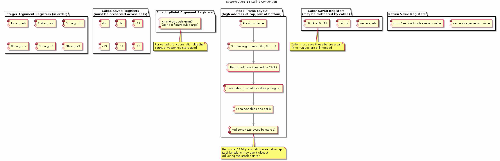
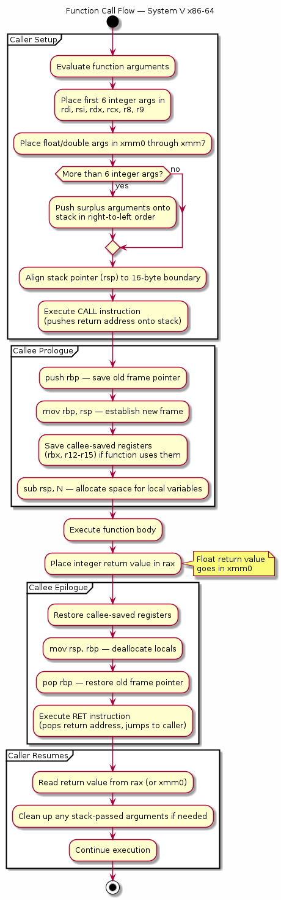

# Chapter 31 — Calling Conventions

## Overview
When one function calls another, both sides must agree on exactly how arguments are passed, where the return value goes, and which registers are preserved. On x86-64 Linux, the System V AMD64 ABI defines these rules precisely. This chapter covers parameter passing in registers, the stack frame layout, callee- vs caller-saved registers, the 128-byte red zone, and how variadic functions like `printf()` work under the hood.

## Key Concepts
- System V AMD64 ABI — the standard calling convention on Linux x86-64
- Integer parameter registers: `rdi`, `rsi`, `rdx`, `rcx`, `r8`, `r9` (in order)
- Floating-point parameters in `xmm0`–`xmm7`
- Stack frame layout: return address, saved `rbp`, local variables
- Callee-saved registers: `rbx`, `rbp`, `r12`–`r15` (must be preserved)
- Caller-saved registers: `rax`, `rcx`, `rdx`, `rsi`, `rdi`, `r8`–`r11` (may be clobbered)
- The red zone: 128 bytes below `rsp` that leaf functions can use without adjusting the stack
- Variadic functions: `va_list` internals, `al` register for SSE argument count
- 16-byte stack alignment requirement before `call`

## Sections
| # | Section | Description |
|---|---------|-------------|
| 1 | The System V ABI | Overview of the x86-64 calling convention on Linux |
| 2 | Parameter Passing | Integer and floating-point register assignment order |
| 3 | Stack Frame Layout | return address → saved rbp → locals → alignment padding |
| 4 | Callee vs Caller Saved | Which registers a function must preserve and which it may trash |
| 5 | The Red Zone | The 128-byte optimisation for leaf functions |
| 6 | Variadic Functions | How `va_start`/`va_arg` work — register save area and overflow |
| 7 | Inspecting Conventions | Using `gcc -S` and GDB to observe register and stack usage |

## Building & Running
```bash
make bin/31_calling_conventions
./bin/31_calling_conventions
```

## Diagrams
- 
- 

## Try It Yourself
```bash
# Generate Intel-syntax assembly to see register usage
gcc -S -masm=intel -O0 -o /tmp/calling.s src/31_calling_conventions/main.c
cat /tmp/calling.s

# Look at how arguments are passed in the assembly
grep -E "mov.*edi|mov.*esi|mov.*edx" /tmp/calling.s

# Step through in GDB and examine registers at a function call
gdb -batch -ex "break main" -ex "run" -ex "info registers" ./bin/31_calling_conventions

# Check the stack frame in GDB
gdb -batch -ex "break main" -ex "run" -ex "info frame" ./bin/31_calling_conventions

# Observe red zone usage in a leaf function (compile with -O2)
gcc -S -masm=intel -O2 -o /tmp/calling_opt.s src/31_calling_conventions/main.c
grep -A5 "leaf_function" /tmp/calling_opt.s

# Show that -mno-red-zone changes leaf function codegen
gcc -S -masm=intel -O2 -mno-red-zone -o /tmp/calling_norz.s src/31_calling_conventions/main.c
diff /tmp/calling_opt.s /tmp/calling_norz.s
```

## Further Reading
- [System V AMD64 ABI Specification](https://refspecs.linuxbase.org/elf/x86_64-abi-0.99.pdf)
- [man 3 stdarg](https://man7.org/linux/man-pages/man3/stdarg.3.html) — variadic function macros
- Agner Fog, [Calling conventions for different C++ compilers and operating systems](https://www.agner.org/optimize/calling_conventions.pdf)
