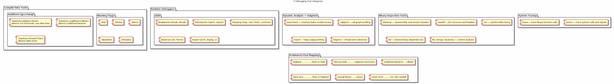
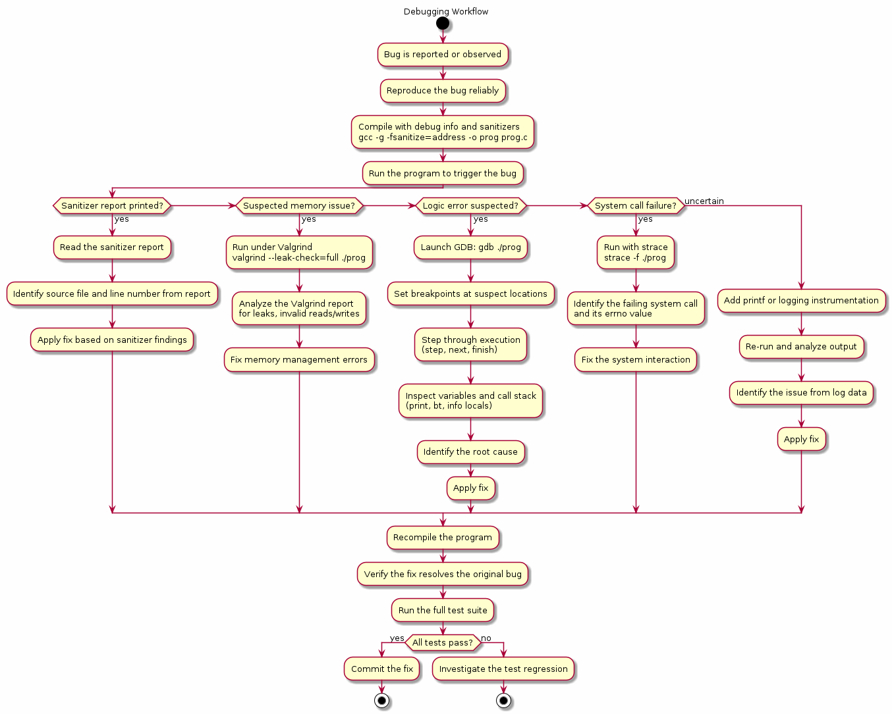

# Chapter 33 — Debugging Tools

## Overview

Writing C code is only half the battle — the other half is finding and fixing the bugs that inevitably creep in. This chapter surveys the essential debugging ecosystem available to C developers on Linux: from interactive debuggers like GDB, through memory-checking tools like Valgrind and compiler sanitizers, to system-call tracers and binary analysis utilities. You will learn a systematic **problem → tool** mapping that helps you pick the right instrument for each class of bug, turning debugging from guesswork into an engineering discipline.

## Key Concepts

- Debugging strategy: mapping symptoms (crash, leak, race, corruption) to the right tool
- GDB essentials: breakpoints, watchpoints, stepping, backtraces, printing expressions, TUI mode
- Valgrind tool suite: memcheck (leaks/invalid access), callgrind (call-graph profiling), cachegrind (cache simulation), massif (heap profiling), helgrind and drd (thread-error detectors)
- Compiler sanitizers: AddressSanitizer (ASan), UndefinedBehaviorSanitizer (UBSan), ThreadSanitizer (TSan), LeakSanitizer (LeakSan)
- System-call tracing with strace and library-call tracing with ltrace
- Binary analysis tools: objdump (disassembly), readelf (ELF headers), nm (symbol table), ldd (shared-library dependencies), file (format identification)
- Compiler warning flags: `-Wall -Wextra -Wpedantic -Werror -Wconversion -Wshadow`
- Combining tools: using sanitizers during development and Valgrind in CI for maximum coverage

## Sections

| # | Section | Description |
|---|---------|-------------|
| 1 | Debugging Strategy | Symptom-to-tool mapping table and triage workflow |
| 2 | GDB Essentials | 16 essential commands: run, break, next, step, continue, finish, backtrace, frame, print, display, watch, info, list, set, tui, quit |
| 3 | Valgrind — memcheck | Detecting memory leaks, use-after-free, uninitialised reads, and invalid accesses |
| 4 | Valgrind — Profiling | callgrind for call graphs, cachegrind for cache misses, massif for heap snapshots |
| 5 | Valgrind — Thread Checkers | helgrind and drd for data races and lock-order violations |
| 6 | Compiler Sanitizers | ASan, UBSan, TSan, and LeakSan — compile-time instrumentation for runtime detection |
| 7 | strace & ltrace | Tracing system calls and dynamic library calls to diagnose I/O and linking issues |
| 8 | Binary Analysis | objdump, readelf, nm, ldd, and file for post-mortem inspection of ELF binaries |
| 9 | Warning Flags | Leveraging the compiler as a first-pass static analyser |

## Building & Running

```bash
make bin/33_debugging_tools
./bin/33_debugging_tools
```

## Diagrams

- 
- 

## Try It Yourself

```bash
# Compile with debug info and AddressSanitizer
gcc -g -fsanitize=address -fno-omit-frame-pointer -o buggy buggy.c
./buggy                        # ASan reports invalid accesses at runtime

# Compile with UndefinedBehaviorSanitizer
gcc -g -fsanitize=undefined -o ubbuggy ubbuggy.c
./ubbuggy

# Run Valgrind memcheck for leak detection
valgrind --leak-check=full --show-leak-kinds=all --track-origins=yes ./buggy

# Trace system calls
strace -f -e trace=open,read,write,mmap ./buggy

# Trace library calls
ltrace -e malloc+free ./buggy

# Interactive GDB session
gdb ./buggy
(gdb) break main
(gdb) run
(gdb) backtrace
(gdb) print variable
(gdb) next
(gdb) watch *address
(gdb) quit

# Inspect an ELF binary
file buggy
readelf -h buggy
nm buggy | grep ' T '
objdump -d buggy | head -80
ldd buggy
```

## Further Reading

- [GDB User Manual](https://sourceware.org/gdb/current/onlinedocs/gdb/)
- [Valgrind Quick Start Guide](https://valgrind.org/docs/manual/quick-start.html)
- [GCC Instrumentation Options — Sanitizers](https://gcc.gnu.org/onlinedocs/gcc/Instrumentation-Options.html)
