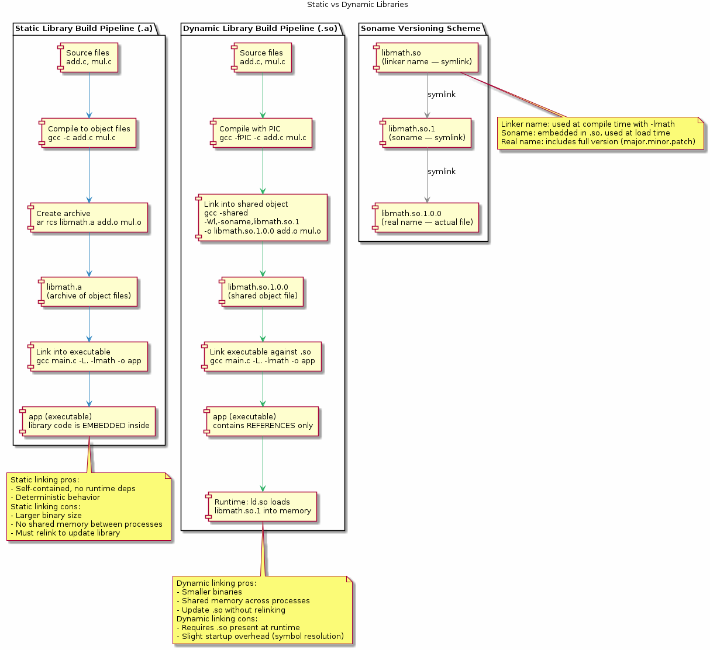
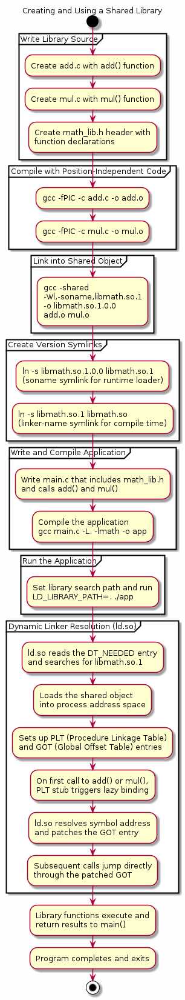

# Chapter 34 — Static and Dynamic Libraries

## Overview

Libraries are the primary mechanism for packaging and reusing compiled code in C. A **static library** (`.a`) is an archive of object files linked directly into the final executable at compile time, while a **dynamic (shared) library** (`.so`) is loaded at runtime by the dynamic linker. This chapter walks through creating both types from scratch — using a concrete `lib_add`, `lib_multiply`, and `lib_square` demo — explains symbol visibility, soname versioning, and shows how `pkg-config` simplifies library discovery in build systems.

## Key Concepts

- Why libraries: code reuse, modular builds, reduced binary size (shared), independent updates
- Creating a static library with `ar rcs` and indexing with `ranlib`
- Creating a shared library with `gcc -shared -fPIC`
- Static vs dynamic comparison: link time, binary size, update model, symbol resolution, portability
- Symbol visibility: default vs hidden, `__attribute__((visibility("hidden")))`, `-fvisibility=hidden`
- `pkg-config`: `.pc` files, `--cflags`, `--libs`, and integration with Makefiles and CMake
- Soname versioning: `libfoo.so.1.2.3`, `libfoo.so.1` (soname), `libfoo.so` (linker name), and `ldconfig`
- Runtime linker search order: `RPATH`, `LD_LIBRARY_PATH`, `/etc/ld.so.cache`, default paths

## Sections

| # | Section | Description |
|---|---------|-------------|
| 1 | Why Libraries | Motivation: reuse, modularity, binary-size savings, independent deployment |
| 2 | Static Libraries (.a) | Compiling objects, `ar rcs`, `ranlib`, linking with `-L` and `-l` |
| 3 | Shared Libraries (.so) | `-fPIC`, `gcc -shared`, setting the soname with `-Wl,-soname` |
| 4 | Static vs Dynamic | Side-by-side comparison table: build, size, update, performance trade-offs |
| 5 | Symbol Visibility | Controlling exported symbols to minimise ABI surface |
| 6 | pkg-config | Writing and consuming `.pc` files for portable library discovery |
| 7 | Soname Versioning | Major/minor/patch scheme, symlinks, and `ldconfig` |
| 8 | Live Demo | Building `lib_add`, `lib_multiply`, `lib_square` as both `.a` and `.so` |

## Building & Running

```bash
make bin/34_libraries
./bin/34_libraries
```

## Diagrams

- 
- 

## Try It Yourself

```bash
# --- Static Library ---
gcc -c lib_add.c lib_multiply.c lib_square.c
ar rcs libmath_demo.a lib_add.o lib_multiply.o lib_square.o
gcc -o demo_static main.c -L. -lmath_demo
./demo_static

# --- Shared Library ---
gcc -fPIC -c lib_add.c lib_multiply.c lib_square.c
gcc -shared -Wl,-soname,libmath_demo.so.1 -o libmath_demo.so.1.0.0 \
    lib_add.o lib_multiply.o lib_square.o
ln -sf libmath_demo.so.1.0.0 libmath_demo.so.1
ln -sf libmath_demo.so.1     libmath_demo.so
gcc -o demo_shared main.c -L. -lmath_demo
LD_LIBRARY_PATH=. ./demo_shared

# --- Inspect Symbols ---
nm libmath_demo.a                    # symbols in static archive
nm -D libmath_demo.so.1.0.0         # dynamic symbols in shared lib
readelf -d demo_shared | grep NEEDED # shared-library dependencies
ldd demo_shared                      # runtime linker resolution

# --- pkg-config ---
export PKG_CONFIG_PATH=$PWD
pkg-config --cflags --libs math_demo
gcc -o demo_pkg main.c $(pkg-config --cflags --libs math_demo)
```

## Further Reading

- [Program Library HOWTO — David Wheeler](https://tldp.org/HOWTO/Program-Library-HOWTO/)
- [GCC — Code Generation Options (-fPIC, -shared)](https://gcc.gnu.org/onlinedocs/gcc/Code-Gen-Options.html)
- Kerrisk, *The Linux Programming Interface*, Chapter 41: Fundamentals of Shared Libraries
