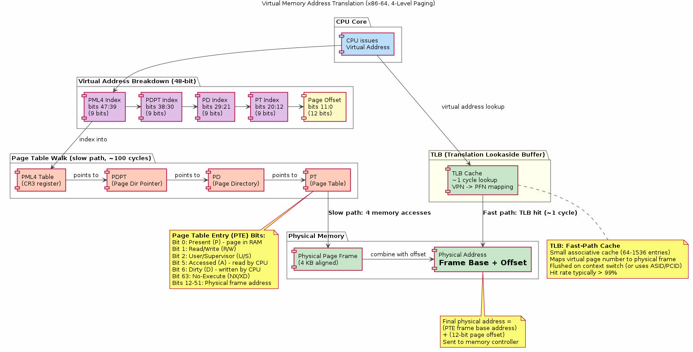
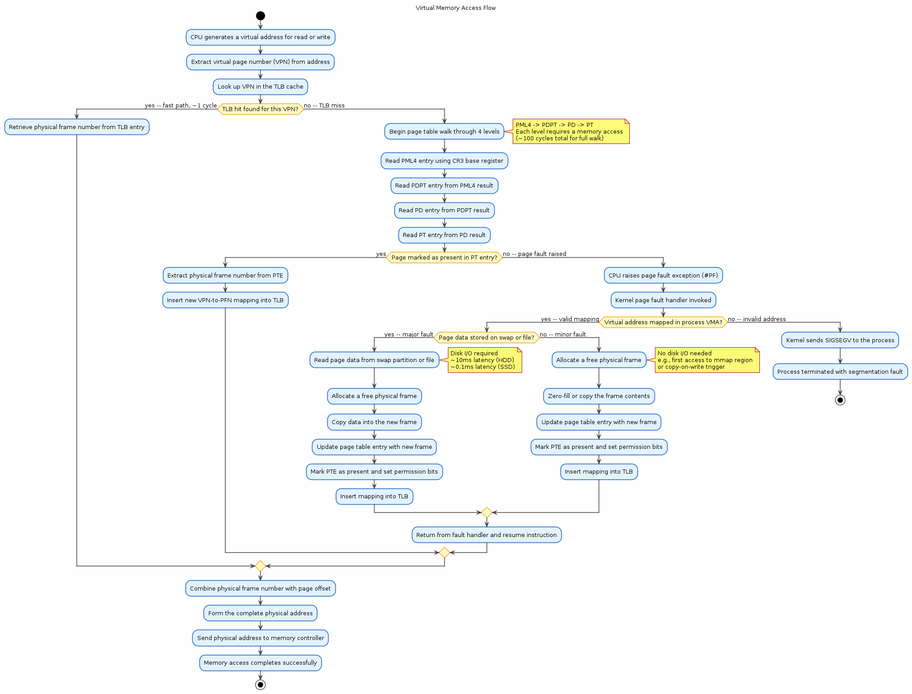

# Chapter 36 — Virtual Memory Deep Dive

## Overview

Virtual memory is the abstraction that gives every process its own private, contiguous address space — even though the physical RAM underneath is finite, fragmented, and shared. This chapter dives into the mechanics of how x86-64 Linux implements virtual memory: four-level page tables, TLB caching, page fault handling, demand paging, copy-on-write, and the OOM killer. It includes a hands-on `mmap` + `mprotect` + `SIGSEGV` signal-handler demo and shows how to inspect any process's memory layout through `/proc`.

## Key Concepts

- Virtual vs physical addresses: per-process illusion of a flat, private address space
- Four-level page tables on x86-64: PGD → PUD → PMD → PTE, 48-bit virtual / 52-bit physical
- Translation Lookaside Buffer (TLB): caching page-table entries for fast address translation
- Page fault types: minor (page in memory, PTE not yet set), major (page must be read from disk), invalid (segfault)
- Demand paging: pages allocated on first access, not at `mmap` / `malloc` time
- Copy-on-Write (COW): shared pages after `fork()`, duplicated only on write
- `mmap` and `mprotect` demo: mapping anonymous memory, changing permissions, catching `SIGSEGV`
- Swap and overcommit: `vm.overcommit_memory`, swap partitions/files, swappiness tuning
- OOM killer: heuristics, `oom_score`, `oom_score_adj`, and how to protect critical processes
- Inspecting virtual memory: `/proc/PID/maps`, `/proc/PID/smaps`, `/proc/PID/pagemap`, `pmap`

## Sections

| # | Section | Description |
|---|---------|-------------|
| 1 | Virtual vs Physical | Why the kernel interposes an address-translation layer |
| 2 | Page Tables | Four-level radix tree on x86-64; page-table entries and permission bits |
| 3 | TLB | How the CPU caches translations; TLB flushes and shootdowns |
| 4 | Page Faults | Minor, major, and invalid faults; the kernel's fault-handling path |
| 5 | Demand Paging | Lazy allocation: virtual pages backed by physical frames only on first touch |
| 6 | Copy-on-Write | Shared mappings after `fork()`; write-triggered duplication |
| 7 | mmap + mprotect Demo | Anonymous mapping, permission toggling, SIGSEGV signal handler |
| 8 | Swap & Overcommit | Swap space, overcommit policies, swappiness, and the memory cgroup |
| 9 | OOM Killer | Scoring heuristic, tuning `oom_score_adj`, and systemd `OOMPolicy` |
| 10 | Inspecting VM | `/proc/PID/maps`, `smaps`, `pagemap`, `pmap`, and `vmstat` |

## Building & Running

```bash
make bin/36_virtual_memory
./bin/36_virtual_memory
```

## Diagrams

- 
- 

## Try It Yourself

```bash
# --- View your shell's memory map ---
cat /proc/self/maps

# --- Detailed memory stats for a running process ---
pmap -x $(pidof 36_virtual_memory)

# --- System-wide virtual memory statistics ---
vmstat 1 5

# --- Memory overview ---
cat /proc/meminfo | head -20

# --- Check overcommit policy ---
cat /proc/sys/vm/overcommit_memory
cat /proc/sys/vm/overcommit_ratio

# --- Inspect a process's smaps for RSS/PSS/Shared/Private breakdown ---
cat /proc/self/smaps | head -40

# --- Watch page faults in real time (minor/major) ---
ps -o pid,min_flt,maj_flt,cmd -p $$

# --- Run the mmap + mprotect demo ---
./bin/36_virtual_memory
# Observe: mmap anonymous region → write → mprotect PROT_NONE → trigger SIGSEGV → handler fires

# --- Check a process's OOM score ---
cat /proc/$$/oom_score
cat /proc/$$/oom_score_adj
```

## Further Reading

- Gorman, *Understanding the Linux Virtual Memory Manager* — [online](https://www.kernel.org/doc/gorman/)
- Kerrisk, *The Linux Programming Interface*, Chapters 49–50: Virtual Memory Operations
- [Linux kernel docs — vm](https://www.kernel.org/doc/html/latest/admin-guide/mm/index.html)
